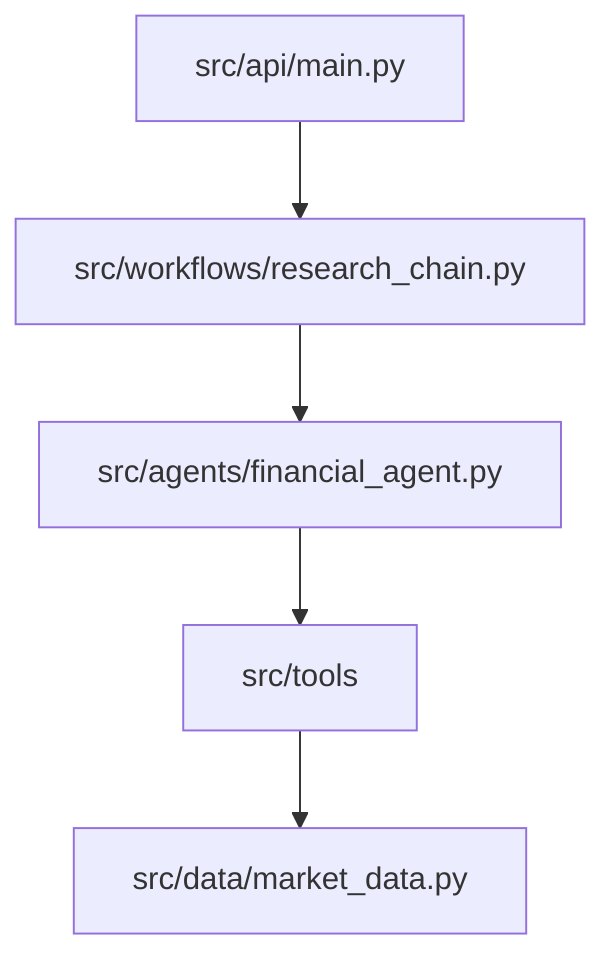

# C4 Level 4 – Code Diagram

```mermaid
flowchart TB
API[src/api/main.py]
Workflow[src/workflows/research_chain.py]
Agent[src/agents/financial_agent.py]
Tools[src/tools]
Data[src/data/market_data.py]

API --> Workflow
Workflow --> Agent
Agent --> Tools
Tools --> Data
```
